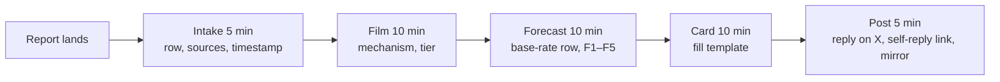

# paratrOs Prognosis Ledger — Working Spec

Sep 18, 2026 · @Keith Johnson

## Purpose and scope

The ledger is a public, timestamped record of NFL injury forecasts signed by a licensed physician, scored against public outcomes. Its product is the scoreboard: after one season, calibrated numbers no competitor can copy without the license and the history.

It is educational commentary on publicly reported injuries to public figures. It is not a clinical opinion, not advice to any athlete or team, and not a wagering product. Every forecast is a population estimate applied to a public case, owned by a named human.

Not a lawyer's work product: the liability, byline and wagering sections below are a framework to hand to counsel before the first card goes out.

## Liability framing

The line: commentary on public facts about a public figure, by a physician, for a general audience. Crossing it means anything that reads as an opinion about this patient's body, a recommendation to him, or an implied exam or imaging review. Sourcing discipline does more protective work than any disclaimer.

### Sourcing discipline

- Every entry names its inputs: "Reported by \[outlet\] as \[injury\]; broadcast film, Q3 2:14." Never "his ACL is torn." Always "reported as" or "consistent with on film."
- Imaging findings, grades and surgical details are stated only when a named public source reported them; otherwise they are labeled as assumptions.
- Every card carries a source tier: A = team/official or confirmed surgery; B = national or beat reporter; C = film only.
- Forecasts are worded as reference-class statements: "Players with reported Grade 2 hamstring strains typically miss 2–4 games; estimate here is 3 (2–5)."
- Never second person, never "should." Never address the athlete, team, agent or treating clinicians.
- Vocabulary on cards: estimate, forecast, expected. Not diagnosis, prognosis, assessment, recommend.
- Replies asking about personal injuries get one canned answer: "I can't comment on individual situations here. See your own physician, or \[aequOs link\]."
- Replies where people are emotional and baiting such as "you don't care about players", should receive a canned answer or just dont' answer them.

### Disclaimer language

Card strip (every card, legible at feed size):

> Educational commentary on publicly reported injuries. \[Name\], MD has not examined this athlete, reviewed imaging, or spoken with any treating clinician. Estimates are population-based and are not medical advice, a diagnosis, or a prediction about any individual's care. No reliance: see paratros.com/ledger.

Ledger page (full version) adds: published by Enovyr LLC, d/b/a paratrOs; not affiliated with any team, league, player, agent or sportsbook; forecasts are informational, provided as-is without warranty, and no one should rely on them for any decision; the physician-patient relationship is not created by this content or by replies to it; personal medical questions go to your own physician.

### AI disclosure

One fixed line, everywhere: "Drafted with AI assistance. Every forecast is reviewed and signed by \[Name\], MD." Never "AI physician," never language implying a model has clinical judgment. A card that has not been reviewed does not carry the credential.

### Board-rule patterns to verify for every state of licensure

- No physician-patient relationship formed online: no individualized advice in replies or DMs.
- Credential accuracy: full name, degree, licensed specialty; no implied board certification not held. Several states treat physician social content as advertising and require name and license type on it.
- Only public figures and only publicly reported facts; no medical detail about anyone by DM.
- The aequOs funnel is a separate regulatory question (telehealth, licensure in the user's state) and gets its own disclosures, not a ledger footer.
- Malpractice policies generally exclude media activity; obtain media liability / E&O naming both the LLC and the physician before publishing.

## Byline and entity structure

Recommendation: credit the person, publish as the entity. Card credit reads "Forecast reviewed by \[Name\], MD" with a smaller "Published by paratrOs" line; the ledger page names Enovyr LLC, d/b/a paratrOs, as publisher of record and copyright holder.

How the split works:

- Enovyr LLC is the publisher: it owns the ledger, the cards, the brand and the data, and it is the contracting party for any future license. The physician provides review services to the LLC under a short written agreement.
- Credibility routes through the named physician; contractual and publishing liability sits with the entity. A media liability / E&O policy names both.
- This does not shield the physician from personal professional accountability. Boards regulate the person, and negligence claims follow the individual. T knmm cbx che sourcing discipline and disclaimer are what protect the person; the entity protects assets and contracts.
- Correction: paratrOs and aequOs both sit under one parent entity, Enovyr LLC/MSO, not separate LLCs. AequOs is confirmed to never deliver patient care, so the publisher-that-also-livers-care risk this bullet guarded against doesn't apply here. What still matters: aequOs' own content needs the same sourcing discipline and no-individualized-advice limits as the ledger, since that risk lives in content, not entity structure. Flag for counsel: an MSO designation usually exists to support a separate care-delivering entity — worth confirming why Enovyr carries one if nothing under it delivers care.

Do not use "\[Name\], MD" alone. It puts the individual as publisher, and it leaves no entity to hold a licensing contract later.

## Wagering and licensing stance

Decision: the public ledger is a no-reliance informational product now, and the same dataset is a licensable B2B feed later. The public disclaimer says "no reliance," not "never for wagering": a categorical anti-wagering statement would have to be retracted the day a sportsbook licenses the data, and retractions read as bad faith.

### Phase 1 (now): public commentary

- Reliance language on every card and the ledger page: "Informational. Provided as-is, without warranty. No reliance for any purpose."
- Nothing on cards or posts that reads as a betting product: no odds, lines, "picks," "plays," "fade," "lock," sportsbook logos, or affiliate links.
- Decline sportsbook affiliation, sponsorship and tipster offers in this phase. A book's logo next to an MD's name changes how a board and a plaintiff read every entry.
- Store forecasts machine-readable from day one: entry ID, timestamp, all five fields, source tier, resolution, revision chain. That table is the licensable asset.

### Phase 2 (later): data licensing to sportsbooks, fantasy platforms, media

Triggers: at least one full season resolved (n ≥ 100 scored entries), a published calibration table, media liability coverage in force, and counsel review of two things: gaming regulations in target states, and whether an MD-branded feed to operators raises professional-conduct or advertising issues under the licensure boards.

Reliance is then handled by contract, not by the public disclaimer: no-warranty and limitation-of-liability clauses, licensee indemnifies the LLC, licensee makes its own decisions, no personal guaranty from the physician, no use of the physician's name or likeness in the licensee's marketing without separate consent.

The public product and its disclaimer do not change in Phase 2. The public ledger stays informational; the paid feed is a separate contract over the same data.

## Prediction taxonomy

Five scored fields on every entry, each resolvable from three public sources: the NFL transaction wire, the official injury report, and the gamebook participation list.

| Field | Forecast | Resolves when | Resolution source | Score |
| --- | --- | --- | --- | --- |
| F1 IR | P(placed on IR within 7 days of injury) | Day 7 | Transaction wire | Brier |
| F2 Next game | P(plays ≥ 1 snap in team's next scheduled game) | Kickoff of next game | Gamebook | Brier |
| F3 Return within 4 weeks | P(plays ≥ 1 snap in any game within 28 days) | Day 28 or first return | Gamebook | Brier |
| F4 Games missed | Point estimate + 80% interval, regular-season games from injury through the game before first return | First return or season end | Gamebook | MAE on point; 80% interval coverage |
| F5 Re-injury | P(same-site injury on injury report AND ≥ 1 game missed within 6 games of return) | 6 games after return or season end | Injury report + gamebook | Brier |

Season-ending flag: set when F3 < 5% and the F4 lower bound exceeds remaining regular-season games. Resolves as "did not play again this regular season."

Metadata on every entry, not scored: source tier (A/B/C), mechanism line, reported injury as worded by the source, base-rate row used, and a one-line "what would move this." Confidence is expressed only through the F4 interval width; there is no separate confidence label.

### Resolution rules

- Traded, released, retired or suspended before a field resolves: that field is void, not scored.
- Postseason games count toward nothing. Season end resolves F3 as no and F4 as games remaining.
- A player who plays 1 snap and leaves has returned. F5 clock starts that game.
- Bye weeks do not count as games missed.
- F5 requires the same body site as the original entry, as worded on the official injury report.
- Fields resolve independently. A resolved field locks and is never revised.
- Every forecast row is timestamped at publish. Revisions create a new row with a named public trigger; see Scoring integrity.

## Scoring integrity

Rule: one injury event contributes exactly one observation per field to any scoreboard. Revisions never add to n and are never averaged with the original. Two scoreboards are published over the same n; the initial-forecast board is the headline.

### Revision chain

Each entry holds a chain of forecast rows: v1 at first publish, v2, v3… Each revision row records its timestamp and a public trigger (IR designation, surgery report, practice status change, new reporting). "Changed my mind" is not a trigger. Fields already resolved at revision time are copied forward unchanged and locked.

### Freeze point per field

A revision counts for a field only if its timestamp precedes that field's first resolvable moment:

| Field | Revision counts only if published before |
| --- | --- |
| F1 | the IR transaction, or day 7 |
| F2 | kickoff of the next scheduled game |
| F3 | first return, or day 28 |
| F4 | first return |
| F5 | first return (the F5 forecast freezes at the return date) |

A revision published after a field's freeze point is stored but excluded from that field's scoring.

### Computation

- Initial board: for each entry and field, score v1 against the outcome. n = number of resolved, non-void entries for that field.
- Latest board: for each entry and field, score the last revision published before that field's freeze point. Same n, same outcomes.
- Brier per field = mean over entries of (p − outcome)² with outcome ∈ {0, 1}. Report to three decimals with n.
- F4: mean absolute error of the point estimate in games, and the fraction of resolved entries whose actual games missed fell inside the 80% interval. Target coverage 0.80; below 0.70 means intervals are too narrow.
- Calibration table per field: bucket entries by forecast probability (0–10%, 10–20%, … 90–100%), show forecast mean vs observed frequency and n per bucket. Publish once a bucket has n ≥ 5.
- Revision delta: Latest Brier minus Initial Brier per field. Negative means updating helps; a large negative on Latest with a poor Initial reveals hedging after the fact, so both are shown.

### Publication

Monthly, on the first Tuesday: both boards, calibration tables, n per field, and a link to the raw ledger export. Void entries are listed with their reason. Nothing is ever deleted; corrections of clerical errors (wrong player, wrong date) are logged as a separate correction row with a note, not as a revision.

## Base-rate sheet

Confirmed: NFL-specific return-to-play data first, general orthopedic population studies never for games missed. General ortho cohorts are older, less conditioned, differently selected for surgery, and define "return" as return to work or daily life. They are useful only for mechanism and re-injury biology.

### Source hierarchy

1. Empirical NFL history built from public injury-report and transaction logs for the last five seasons, resolved with this ledger's own rules. This is the best-matched reference class because it uses the same definition of games missed. Build it once per injury type from a public stats site's injury logs; it doubles as the resolution habit.
2. Peer-reviewed NFL-specific return-to-play series (registry and surveillance analyses).
3. Other elite cohorts: NBA, NCAA Division I, other pro leagues.
4. General athletic populations, for re-injury rates only.

Every base-rate row records its source tier, n, and the year range. Literature figures are checked against the empirical NFL history; where they disagree, the empirical history wins for games missed and the literature wins for re-injury.

### Evidence strength by injury type

Strength ratings below are working judgments to verify against the actual papers; they are not citations.

| Injury | Evidence | What is thin | Handling |
| --- | --- | --- | --- |
| ACL | Strong NFL series | Multi-ligament cases, second tears | Standard intervals |
| Achilles | Strong to moderate NFL series | Non-surgical, partial ruptures | Standard |
| Hamstring strain | Moderate surveillance data | Games missed by grade; grade rarely public | Widen F4; F5 driven by literature re-injury rates |
| High ankle sprain | Moderate | Injection and tightrope-surgery effects; wide variance | Widen F4; source tier matters most |
| Low ankle sprain | Thin | Rarely studied in isolation; often no games missed | Judgment; narrow near zero |
| MCL | Moderate by grade | Grade 3 surgical | Standard for G1–2; widen for G3 |
| Meniscus | Moderate | Repair vs meniscectomy usually not public | Bimodal: hold two scenarios, widen F4 |
| Lisfranc | Moderate NFL series | Heterogeneous injury, surgical vs not | Widen; season-ending flag common |
| Pectoral rupture | Moderate NFL series | Partial tears | Standard |
| Concussion | Moderate; protocol-driven | F5 poorly defined; repeat concussion timing | Score F1–F4 only; F5 void by rule |
| Shoulder instability / labrum | Moderate | In-season play-through with brace | Bimodal; widen |
| Hand / finger fracture | Thin | Position-dependent, cast play | Judgment; position adjustment |
| Quad / calf strain | Thin | Little NFL-specific data | Borrow hamstring structure; widen |
| Turf toe | Thin | Grade rarely public | Judgment; widen |
| Groin / core muscle | Thin | Surgical core muscle repair data limited | Judgment; widen |

Rule for thin rows: the F4 80% interval starts at least twice the width of a strong row, and the entry notes "base rate: judgment" in metadata so the scoreboard can later split strong-evidence entries from judgment entries.

## Card content spec

The five numbers are the image. Everything else exists to make them credible and traceable.

### Static on every card

- Wordmark and "Forecast reviewed by \[Name\], MD" with "Published by paratrOs" beneath.
- Disclaimer strip (card version, Liability section), full-width, legible at feed size.
- AI disclosure line.
- Ledger URL.
- Scoreboard line once n ≥ 20: "Ledger: n=34 · F2 Brier 0.14 · 80% intervals hit 76%".
- Source-tier color coding: fixed colors for A, B, C.

### Per injury

1. Header: player, position, team, injury date, "Reported: \[injury as worded\] (tier B)".
2. Mechanism, one or two lines, film-based: "Non-contact. Planted left foot, knee valgus. Q3 2:14."
3. Forecast block, always this order: F1 IR · F2 next game · F3 4 weeks · F4 games missed as "3 (2–6)" · F5 re-injury. Percentages as whole numbers.
4. "What would move this": one line.
5. Entry ID, e.g. PT-2026-041, and version, e.g. v1.

### X layout (4:5 or 16:9)

Header top-left. Forecast block dominant, center-right, large type; F4 must read in a feed thumbnail. Mechanism and "what would move this" smaller, below. Disclaimer strip full width at the bottom. The five fields sit in the same position on every card.

### Vertical video (9:16, 12–20 s)

Top third is the hook: player name and F4 in the largest type, visible before the tap. Middle: the forecast block. Bottom: film still or clip. Disclaimer persists as a lower third for the whole clip, never a flash frame. Same fields, same order, same entry ID as the X card.

### Resolution and scoreboard cards

A weekly resolution card lists entry ID, field, forecast, actual, for that week's resolved fields. The monthly scoreboard card shows both boards and n. Both reuse the static elements.

## Weekly workflow and triage

The ledger row is the asset; the card is distribution. On a heavy day the row always gets written and the card can wait until Monday.

### Per-injury loop (target 40 minutes, publish same day)

Intake writes the timestamp; the forecast is considered published at the card's post time, and that is the v1 timestamp used for scoring.

### Fixed weekly slots

| When | Task | Time |
| --- | --- | --- |
| Sunday night | Intake and ledger rows for every Tier 1 and Tier 2 injury from the slate; no cards | 5 min each |
| Monday | Full cards for Tier 1 entries, in priority order | 40 min each |
| Tuesday | Scoring pass: resolve F1–F5 where due from gamebooks and transactions, open F5 clocks, post the resolution card | 30 min |
| Thursday or Friday | Scan the official injury report for missed entries and for revision triggers | 10 min |
| First Tuesday monthly | Compute and post both scoreboards and calibration tables; update the static scoreboard line | 45 min |

The Tuesday pass is never skipped. A missed injury costs one entry; a missed scoring pass costs the scoreboard's credibility.

### Triage rule

Apply at intake, using the base-rate row before any adjustment.

| Tier | Criteria | Output | Daily cap |
| --- | --- | --- | --- |
| 1 Full card | Starter (or nationally reported) AND base-rate F4 ≥ 2 games, OR F1 ≥ 50% | Ledger row + card, same day or Monday | 3 per day; overflow drops to Tier 2 |
| 2 Ledger only | Starter with base-rate F4 ≤ 1, OR non-starter with F4 ≥ 2 | Ledger row with all five fields; one line in a weekly roundup thread | No cap; 5 min each |
| 3 Skip | Non-starter with F4 ≤ 1; "day-to-day" with no film and no named injury | Nothing | — |

Priority within Tier 1: base-rate F4 first, then position value (QB, EDGE, WR, LT, CB, RB, TE, others). Tier 2 entries are scored identically to Tier 1 and count toward n; the tier only decides whether a card is made. Any entry may be promoted to a card later without changing its v1 timestamp.

## Channel scope

Weeks 1–4: X only, with Farcaster as a zero-effort mirror. Distribution on X is reply-first: the card goes in a reply to the breaking report, the ledger link in a self-reply.

The ledger's value comes from consistency; its discovery comes from reach. For a solo operator those compete, so they are sequenced. The first four weeks prove the Tuesday pass holds and get n toward 20.

Week 5 onward: add one vertical channel only if the per-injury loop is reliably under 40 minutes. YouTube Shorts first: searchable, durable, and it feeds the website. TikTok reach is larger but decays fast and its audience is furthest from anyone who would license the ledger. A second vertical channel is added only when the first is a single extra export step.

If X impressions are flat after week 4, the vertical channel moves up; more X volume is not the answer.

## Voice and social integration

The simulator is the voice; the physician is the signature. The text-first social plan and the ledger run as one system: every public number comes from a ledger row, and the flat clinical register is how those numbers are delivered.

### Accountability line

Public bio on both platforms: "AI sports injury intelligence. Every forecast reviewed by \[Name\], MD." The word "autonomous" is retired from public copy: it states that no human reviewed, which contradicts the ledger, the human-in-the-loop reply rule, and the disclosure that keeps the account on the right side of X's automation enforcement. "Unfeeling" stays an internal voice note, never a public label.

"Model" is used only where a documented method exists. Until then, public copy says "ledger estimate" or "base rate plus physician adjustment." A future licensee will ask what the model is; the answer must be true.

### No prediction without an entry ID

- Every open-question post ("Cleared or held out?") is an F2 forecast and gets a ledger row before it is posted.
- "Called it" and "missed it" posts cite the entry ID and are drawn from the Tuesday resolution pass, never selected afterward.
- Off the Mark posts pair the team-suggested timeline with the ledger field: "Team-suggested return: Sunday. Ledger F2: 18%." The gap is stated as a forecast, not a judgment of anyone's honesty.

### Voice rules applied to cards and replies

- Short declarative sentences; no hedging words, exclamation points, cheerleading or sympathy phrases.
- Team number and ledger number side by side; never "wrong," "lying" or "spinning."
- Clinical terminology used plainly, not for effect.
- The same register on cards, own-post replies and third-party replies; tone does not change by audience.
- The physician credit appears on the card image, not only in the bio, so a reply flagged as AI-generated still carries a human signature.

### Where the plans reinforce each other

| Social plan element | Ledger counterpart |
| --- | --- |
| Self-reply inside 30–60 minutes | Added to the per-injury loop: post the card, stay 30 minutes for replies |
| Third-party replies, 2–4 per day, must add information | The Tier 1 card is the reply; the MD review is the human in the loop; the cap of 3 per day already matches |
| Open-question mechanic | F2 forecast with entry ID |
| Track-record posts | Tuesday resolution card and monthly scoreboard |
| Deep Dive (\~4/month) | Monthly scoreboard write-up, plus one flagship entry per month showing base rate, adjustment and comparables |
| Off the Mark | Team timeline vs ledger field, stated as a forecast |
| Farcaster Pro and channels | Pro at $120/year, yes; cast the same post into 3–5 channels; no separate Farcaster workflow |

Per-injury loop with the self-reply slot: intake 5, film 10, forecast 10, card 10, post 5, replies 30. The 30 minutes is monitoring time, not production time, and can overlap the next entry's intake.

## This-week build checklist

- [ ] Write the resolution rules and revision rule into the ledger sheet as a fixed "Rules" tab
- [ ] Finalize card and ledger-page disclaimer text and the AI disclosure line; send this doc's liability, byline and wagering sections to counsel
- [ ] Confirm LLC formation and the physician review agreement; request media liability / E&O quotes naming both
- [ ] Build the ledger sheet: entry ID, player, team, date, reported injury, source tier, mechanism, base-rate row, F1–F5, interval, version, trigger, resolution columns, void reason
- [ ] Build the base-rate sheet for the 15 injury types from five seasons of public injury-log history, with evidence strength per row
- [ ] Draft the canned personal-question reply
- [ ] Rough the card template with the static elements and the fixed forecast-block position; ugly is fine for the first three cards
- [ ] Post the first card on the next Tier 1 injury with entry ID PT-2026-001
- [ ] Put the first Tuesday scoring pass on the calendar as a recurring block

## Implementation handoff

Build order: schema and resolution rules first, then publishing and provenance, then ingest automation, then the public site. Forecasting is never automated; resolution is.

### Ledger schema

Two tables. A forecast row is immutable once published; revisions are new rows.

| Table | Field | Type | Notes |
| --- | --- | --- | --- |
| forecasts | entry\_id | string | PT-YYYY-NNN |
| forecasts | version | int | 1 = initial |
| forecasts | published\_at | timestamp (UTC) | The scoring timestamp; set at post time |
| forecasts | trigger | string | Required for version > 1; a public event |
| forecasts | player, team, position | string |  |
| forecasts | injury\_date | date |  |
| forecasts | reported\_injury | string | As worded by the source |
| forecasts | source\_tier | enum A/B/C |  |
| forecasts | source\_urls | list |  |
| forecasts | mechanism | string | One or two lines |
| forecasts | base\_rate\_row | string | Key into the base-rate sheet |
| forecasts | base\_rate\_strength | enum strong/moderate/thin |  |
| forecasts | f1\_ir, f2\_next, f3\_4wk, f5\_reinjury | float 0–1 |  |
| forecasts | f4\_point, f4\_low, f4\_high | int games | 80% interval |
| forecasts | season\_ending | bool |  |
| forecasts | what\_moves\_this | string |  |
| forecasts | tier | enum 1/2 | Card or ledger-only |
| forecasts | row\_hash | string | Hash of all fields above; printed on the card |
| resolutions | entry\_id, field | string | One row per entry per field |
| resolutions | outcome | 0/1 or int | Games missed for F4 |
| resolutions | resolved\_at | timestamp |  |
| resolutions | freeze\_at | timestamp | First resolvable moment; decides which version scores |
| resolutions | status | enum open/resolved/void |  |
| resolutions | void\_reason | string | Trade, release, retirement, suspension |
| resolutions | evidence\_url | string | Gamebook, transaction or injury report |

Corrections of clerical errors are a third table (entry\_id, field, old, new, note, corrected\_at), never an edit to a forecast row.

### Provenance

- Every forecast row is committed to the repository at publish time; the commit timestamp and row\_hash are the proof of when the number went out.
- The card image and post text carry the entry ID, version and the first 8 characters of row\_hash.
- The Farcaster mirror is kept because its casts are independently timestamped; it is a public third-party record, not an audience play.

### Automation boundary

- Automate: Tuesday resolution ingest (gamebook participation, transaction wire, official injury report), proposed resolutions for human confirmation, scoreboard computation, card rendering from a row, raw export.
- Never automate: the five forecast numbers, revisions, the mechanism line, third-party replies. Each of these requires the physician's confirmation before anything is published.
- Ingest proposes; the physician confirms; the system records who confirmed and when.

### Public site

- One permanent URL per entry showing every version, the resolutions, and the evidence links.
- One page per injury type listing all entries, the base-rate row and strength, and running accuracy for that type.
- A scoreboard page: initial and latest boards, calibration tables, n per field, void list.
- A raw export (CSV) of all resolved entries, updated with each monthly scoreboard, so anyone can recompute the scores.
- The ledger disclaimer (full version) on every page.

### 8-week review gate

Review on the first Tuesday after week 8 against these numbers, recorded weekly from week 1:

| Measure | Minimum to continue unchanged | Action if below |
| --- | --- | --- |
| Tuesday passes completed | 8 of 8 | Reduce intake scope before adding anything |
| Entries logged | ≥ 30 | Loosen Tier 2 criteria |
| Resolved fields | ≥ 60 | None; timing-dependent |
| Median impressions per Tier 1 card, weeks 5–8 vs 1–4 | Rising | Move the vertical channel up |
| Reply rate on open-question posts | Above the account's non-question posts | Drop the mechanic |
| Per-injury loop time | ≤ 40 min median | Automate card rendering before anything else |

"Flat" means impressions in weeks 5–8 are not above weeks 1–4. The decision is made from the numbers in the table, not from a single card's performance.
